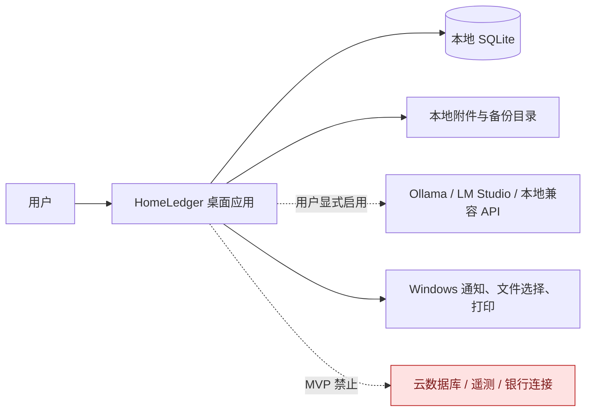
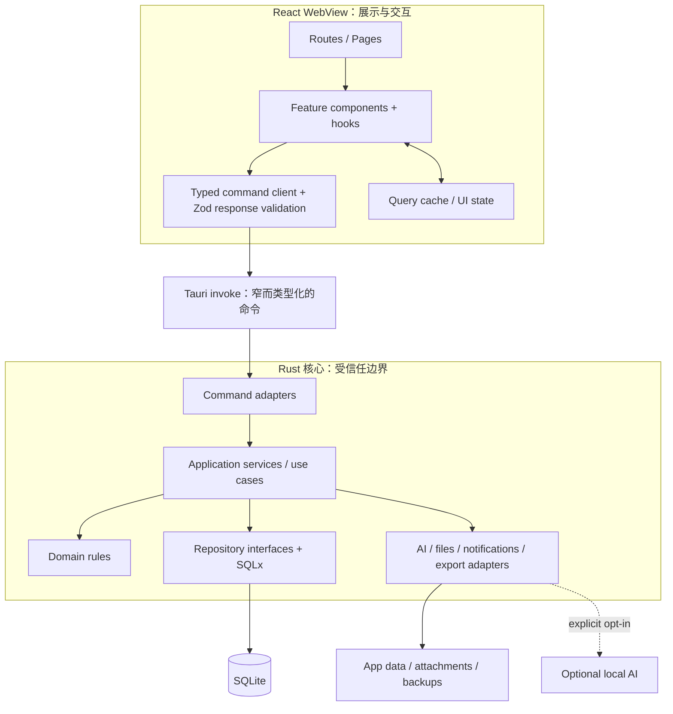
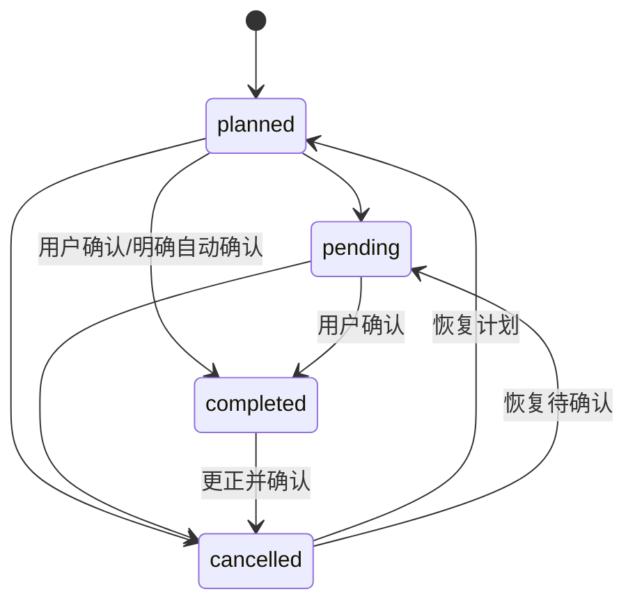
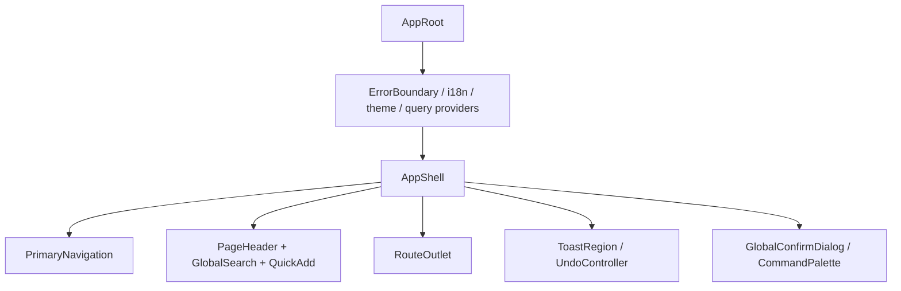
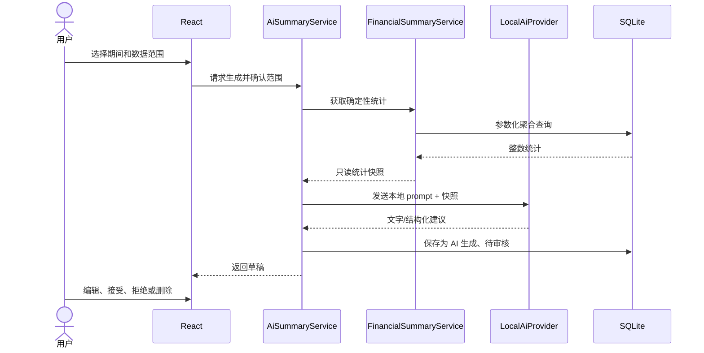

# HomeLedger 架构设计

> 本文定义 MVP 的系统边界、分层、页面与组件结构。数据库的字段级定义见 [DATA_MODEL.md](./DATA_MODEL.md)，实施顺序见 [PLAN.md](./PLAN.md)。

## 1. 架构目标

HomeLedger 是单机、本地优先、可长期保存的家庭事件与财务管理应用。架构按以下优先级取舍：

1. **正确性**：金额、状态和时间边界必须确定且可测试。
2. **隐私**：默认无网络、无遥测、无云依赖，最小化 WebView 权限。
3. **可追溯**：导入、AI 建议、软删除、恢复和关键修改均可定位来源。
4. **可恢复**：数据库、附件和设置作为一个有版本的资料库备份。
5. **可维护**：UI 不包含 SQL 或核心财务规则；业务逻辑可脱离 Tauri 测试。
6. **性能**：以 50,000 条交易为明确基线，避免全量读取和全量渲染。
7. **可迁移**：Windows 11 优先，路径、通知和时区抽象不绑定 Windows 实现。

## 2. 系统上下文



核心功能不依赖 AI 或网络。AI 端点默认只允许 loopback 地址；若未来允许非 loopback，必须单独提示数据离开本机的风险并要求逐次或持久确认。

## 3. 总体分层



### 3.1 React 展示层

职责：

- 路由、布局、表格/日历/图表渲染。
- 表单交互与即时 Zod 校验。
- 加载、空数据、错误、成功、撤销和冲突状态。
- 调用有业务含义的 command，例如 `create_transaction`，而非 `execute_sql`。
- 缓存查询结果，并在 mutation 成功后按 query key 精确失效。

禁止：

- 直接执行 SQL 或操作 SQLite 文件。
- 决定实际收入/支出的统计口径。
- 用 JavaScript 浮点数进行最终金额计算。
- 构造任意文件系统路径或直接读取附件。
- 让 AI 返回的值覆盖确定性统计。

### 3.2 Tauri command 适配层

职责：

- 反序列化输入、调用 application service、统一映射错误。
- 保持命令粒度与用户用例一致。
- 返回稳定 DTO，不泄漏 SQLx 类型或内部路径。

命令示例：

- `list_transactions(query)`
- `create_transaction(input)`
- `update_transaction(id, expected_version, patch)`
- `delete_transactions(ids)` / `restore_transactions(ids)`
- `get_calendar_range(start_date, end_date, filters)`
- `materialize_recurring_items(until_date)`
- `get_monthly_report(year, month)`
- `preview_import(file_token, mapping)` / `commit_import(preview_id)`
- `create_backup(options)` / `inspect_backup(file_token)` / `restore_backup(...)`
- `generate_ai_summary(request)` / `review_ai_suggestion(...)`

不提供：任意 SQL、任意 shell、任意 URL fetch、任意路径 read/write。

### 3.3 Application service 层

一个 service 对应一个可审计用例，负责事务边界、权限/状态检查和跨 repository 编排。主要服务：

| Service                   | 核心职责                                    |
| ------------------------- | ------------------------------------------- |
| `TransactionService`      | CRUD、状态转换、转账、批量操作、审计        |
| `CatalogService`          | 分类、支付方式、地点、成员、标签的停用/恢复 |
| `CalendarService`         | 日期范围聚合、每日详情、事件关联            |
| `RecurrenceService`       | occurrence 计算、预览、幂等物化、补查       |
| `ReminderService`         | 到期计算、授权、投递、投递日志              |
| `FinancialSummaryService` | 唯一实际统计口径、月/年/分类/趋势           |
| `SearchService`           | FTS 与结构化筛选组合                        |
| `ImportService`           | 预览、映射、校验、去重、事务提交、撤销      |
| `ExportService`           | CSV/Excel/PDF/税务资料包                    |
| `BackupService`           | 一致性快照、manifest、校验、恢复、回滚      |
| `AiSummaryService`        | 数据快照、provider、输出记录、审核工作流    |

### 3.4 Domain 层

纯 Rust 规则，不依赖 Tauri、SQLx 或 UI：

- `Money { minor: i64, currency: CurrencyCode }`
- `TransactionType`、`TransactionStatus` 与合法转换。
- `ReportingPeriod` 和用户时区半开区间。
- `FinancialInclusionPolicy`。
- `RecurrenceRule` 和 occurrence 生成。
- `DuplicateFingerprint` 与异常候选规则。
- AI 数据范围和审核状态机。
- 备份版本兼容性判断。

### 3.5 Repository / Infrastructure 层

- SQLx repository 只负责参数化查询和记录映射。
- 多表写操作由 application service 开启 SQL transaction。
- 文件、通知、AI、导出均以 trait 抽象，测试使用 fake/mock。
- SQLite 连接与迁移仅在 Rust 侧可见。

### 3.6 前端技术分工

| 技术                              | 用途与边界                                           |
| --------------------------------- | ---------------------------------------------------- |
| React + TypeScript strict + Vite  | WebView 应用、类型化 UI 与构建                       |
| Tailwind CSS + shadcn/ui          | 设计 token 和无障碍 primitives；不堆叠无意义卡片     |
| Lucide Icons                      | 导航/操作图标；必须同时提供可访问名称或文字          |
| FullCalendar                      | MVP 月视图和事件交互；金额摘要由自定义 day cell 渲染 |
| TanStack Table + TanStack Virtual | 服务端分页表格、列配置、选择和可视行渲染             |
| Recharts                          | 月/年趋势及分类图；同时提供文本或表格替代            |
| React Hook Form + Zod             | 表单状态和前端即时校验；Rust 仍执行最终业务验证      |
| date-fns + date-fns-tz            | UI 显示与本地日期辅助；权威期间边界在 Rust 计算      |
| i18next                           | 中英文文案、日期/数字展示上下文                      |
| TanStack Query                    | 本地 command 异步状态、缓存、取消和精确失效          |

## 4. 技术决策记录

### ADR-001：Rust + SQLx，而非前端 SQL 插件

**决定**：核心数据库访问使用 Rust + SQLx。

**理由**：

- 能强制所有写入经过相同业务规则和事务边界。
- 不向 WebView 暴露通用 SQL 能力，权限面更小。
- 统计、备份、导入和 recurrence 可以直接用 Rust 集成测试。
- SQLx 提供迁移、连接池、事务和参数化查询。

Tauri 2 command 支持前端调用异步 Rust 函数；Tauri capability/permission 用于约束 WebView 能访问的系统能力。参考：

- [Tauri：从前端调用 Rust](https://v2.tauri.app/zh-cn/develop/calling-rust/)
- [Tauri：Capabilities](https://v2.tauri.app/security/capabilities/)
- [SQLx migrations](https://docs.rs/sqlx/latest/sqlx/migrate/)

### ADR-002：数据库是事实来源，UI cache 不是

所有 mutation 先提交数据库，再返回 canonical DTO 与受影响的 query scopes。UI 不做“只改内存、稍后再存”的财务写入。乐观 UI 仅用于非破坏性视觉反馈；失败必须回滚并显示错误。

### ADR-003：基础币种汇总需要保存确定性换算结果

不同币种不能直接相加。每笔收入/支出保存原币金额；若原币不同于报告基础币种，还需保存用户确认的基础币种金额和可选有理数汇率。报告只汇总基础币种整数金额。没有换算结果的外币记录单列为“待换算”，不得静默进入总额。

### ADR-004：时间使用三种明确语义

1. 交易发生日：`YYYY-MM-DD` 本地日历日期，不强制转换为 UTC。
2. 定时事件：UTC instant + IANA `timezone_id`，展示时转换。
3. 全天事件：本地开始日和排他结束日，不用午夜 UTC 模拟。

用户时区默认为 `America/Toronto`。月/年查询由 Rust 将本地边界转换成明确区间，SQL 使用 `>= start AND < end`。

### ADR-005：周期定义与 occurrence 分离

规则本身不等于已发生记录。`recurring_items` 保存模板，`recurrence_rules` 保存规则，`recurring_occurrences` 保存每次实例及其物化结果。唯一键防止重复启动生成重复房租。

### ADR-006：配置采用停用，不破坏历史

分类、支付方式、成员、地点、标签存在引用时不硬删除。`is_active = 0` 后不出现在新建表单的默认选项，但历史记录仍可解析和显示。

### ADR-007：附件使用内容寻址与逻辑 ID

- 数据库保存元数据和相对路径，不保存大 BLOB。
- 导入附件时复制到 app data 内，按 SHA-256 去重，文件名使用内部 ID。
- 前端只传 attachment ID；Rust 验证归属后打开或导出。
- 原文件名只用于显示，不能参与路径拼接。

### ADR-008：AI 是建议系统，不是写权限主体

AI 输入由程序创建带 hash 的快照；输出写入 `ai_summaries` 或 `ai_suggestions`。接受建议时，系统以普通用户操作再次验证并写审计日志。模型永远拿不到数据库连接或任意 SQL 接口。

## 5. 确定性财务规则

### 5.1 唯一统计谓词

实际收入/支出查询必须复用同一语义：

```text
deleted_at IS NULL
AND status = 'completed'
AND transaction_type IN ('income', 'expense')
AND reporting_amount_minor IS NOT NULL
```

- 收入：对 `income` 的 `reporting_amount_minor` 求和。
- 支出：对 `expense` 的 `reporting_amount_minor` 求和。
- 净结余：收入减支出。
- 转账：完全不进入收入、支出和净结余。
- 计划/待确认/取消：可在预测或待办中展示，不进入实际值。

不得在 Dashboard、日历、报告各自复制一套近似条件。实现上使用共享 query builder/SQL view 语义和 service 测试。

### 5.2 金额输入与显示

- UI 接收本地化十进制字符串，不先转 JavaScript `number` 再乘 100。
- Rust 根据 ISO 4217 exponent 解析为 `i64` 最小单位并检查溢出。
- DTO 可返回 `{ minor: "12345", currency: "CAD" }` 字符串形式，避免 JS 安全整数边界问题。
- 格式化使用 `Intl.NumberFormat`，但格式化结果不参与计算。
- 金额在 UI 使用 tabular numerals；负号只用于展示净值，交易金额本身保存绝对值。

### 5.3 状态转换



修改已完成交易允许，但必须增加 `version`、更新时间并写审计事件。自动周期任务默认只能创建 `planned`；“自动确认”是单独的高风险设置，默认关闭并在 UI 明示。

## 6. 前端架构

### 6.1 路由与页面结构

```text
/
├─ /dashboard                         首页
├─ /transactions                      收支记录
│  ├─ ?filters=...                    筛选由 URL/保存筛选恢复
│  └─ /import                         CSV 导入向导
├─ /calendar                          日历
├─ /recurring                         周期项目与提醒
├─ /reports
│  ├─ /monthly/:year/:month           月度报告
│  └─ /annual/:year                   年度报告
├─ /tax                               税务整理与资料包（页面内选择年度）
├─ /timeline                          家庭重要事件时间线
├─ /data
│  ├─ /export                         导出
│  ├─ /backups                        备份历史
│  └─ /restore                        恢复预检
└─ /settings
   ├─ /general                        语言、时区、币种、地区
   ├─ /categories                     分类与子分类
   ├─ /payment-methods                支付方式
   ├─ /members                        家庭成员
   ├─ /tags                           标签与税务标签
   ├─ /appearance                     主题、颜色、无障碍
   └─ /ai                             本地 AI
```

日历提供月、周、日和 12 个月年度概览；年度概览只读展示重要日期与待处理提醒，并可键盘跳转到对应月视图。

### 6.2 应用壳



桌面工具以表格、日历、时间线和抽屉为主要容器，不把每个区域都包装成卡片。Dashboard 可以使用少量高价值摘要面板，但保留清晰主次和足够留白。

### 6.3 Feature 组件树

```text
src/
├─ app/
│  ├─ router/
│  ├─ providers/
│  ├─ shell/
│  └─ styles/
├─ features/
│  ├─ dashboard/
│  │  ├─ DashboardPage
│  │  ├─ PeriodSummary
│  │  ├─ SpendingTrendChart
│  │  ├─ UpcomingBills
│  │  └─ ReviewQueue
│  ├─ transactions/
│  │  ├─ TransactionsPage
│  │  ├─ TransactionToolbar
│  │  ├─ TransactionFilterBuilder
│  │  ├─ TransactionTable
│  │  ├─ TransactionFormDrawer
│  │  ├─ BulkEditDialog
│  │  └─ ImportWizard
│  ├─ calendar/
│  │  ├─ CalendarPage
│  │  ├─ CalendarToolbar
│  │  ├─ MonthCalendar
│  │  ├─ DayCellSummary
│  │  ├─ DayDetailsDrawer
│  │  └─ EventFormDrawer
│  ├─ recurring/
│  │  ├─ RecurringItemsPage
│  │  ├─ RecurringItemForm
│  │  ├─ RecurrenceRuleBuilder
│  │  └─ OccurrencePreview
│  ├─ reports/
│  │  ├─ MonthlyReportPage
│  │  ├─ AnnualReportPage
│  │  ├─ ReportNarrativeEditor
│  │  └─ ExportReportDialog
│  ├─ tax/
│  │  ├─ TaxWorkspacePage
│  │  ├─ TaxDisclaimer
│  │  ├─ CandidateTransactionsTable
│  │  └─ TaxPackageDialog
│  ├─ ai/
│  │  ├─ AiSettingsForm
│  │  ├─ AiDataScopeDialog
│  │  ├─ AiGeneratedBadge
│  │  └─ AiSuggestionReview
│  ├─ backup/
│  └─ settings/
├─ shared/
│  ├─ api/              typed invoke clients and DTO schemas
│  ├─ components/       app-level reusable components
│  ├─ money/            input/display only; no authoritative totals
│  ├─ dates/            display helpers
│  ├─ accessibility/
│  └─ test/
└─ components/ui/       shadcn primitives, minimally customized
```

### 6.4 状态策略

- **Server state**（实际在本地 Rust/SQLite）：TanStack Query 管理请求、缓存和失效。
- **URL state**：筛选、排序、分页、选中报告期间，便于恢复和保存筛选。
- **Form state**：React Hook Form；提交时前端 Zod + Rust domain 双重验证。
- **Ephemeral UI state**：抽屉开关、临时选择、command palette 使用组件状态或小型 context。
- 不引入全局万能 store；只有出现跨路由且无法由 URL/query 表达的状态时再评估。

### 6.5 表格性能

- SQL 做筛选、排序和分页；不把 50k 行发给 WebView。
- TanStack Table 管理列、排序和选择，TanStack Virtual 仅渲染可见行。
- 大批量选中使用“查询条件 + 排除 ID”模型，避免在前端存 50k 个 ID。
- 查询结果只返回列表需要的字段，详情/附件按需加载。
- 搜索输入 debounce，可取消上一请求；所有列表查询都有稳定排序键（如日期 + id）。

## 7. Rust 工程结构

```text
src-tauri/
├─ Cargo.toml
├─ capabilities/
│  └─ main.json
├─ migrations/
│  ├─ 0001_initial.sql
│  └─ ...
└─ src/
   ├─ lib.rs
   ├─ bootstrap.rs
   ├─ commands/
   │  ├─ transactions.rs
   │  ├─ calendar.rs
   │  ├─ reports.rs
   │  ├─ import_export.rs
   │  ├─ backup.rs
   │  └─ ai.rs
   ├─ application/
   ├─ domain/
   │  ├─ money.rs
   │  ├─ transaction.rs
   │  ├─ recurrence.rs
   │  ├─ reporting_period.rs
   │  └─ errors.rs
   ├─ repositories/
   │  ├─ traits.rs
   │  └─ sqlite/
   ├─ infrastructure/
   │  ├─ db/
   │  ├─ attachments/
   │  ├─ backup/
   │  ├─ export/
   │  ├─ notifications/
   │  └─ ai/
   │     ├─ ollama.rs
   │     └─ openai_compatible.rs
   └─ dto/
```

业务 service 和 repository traits 可放在同一 crate 开始；只有编译边界真正带来价值时才拆 workspace crates，避免 Phase 1 过度设计。

## 8. 数据库运行策略

### 8.1 连接与 PRAGMA

应用打开数据库后显式设置并验证：

- `PRAGMA foreign_keys = ON`
- `PRAGMA journal_mode = WAL`
- `PRAGMA synchronous = FULL`（优先数据耐久性；性能基准后才能有依据地调整）
- `PRAGMA busy_timeout = 5000`
- `PRAGMA trusted_schema = OFF`（确认所用 SQLite 功能兼容后启用）

连接池保持较小；SQLite 仍是单写者模型。批量导入、备份和普通编辑通过 application 层协调，避免长写事务阻塞 UI。

### 8.2 迁移

- 迁移文件一旦发布不可修改，只能追加。
- 启动前创建数据库文件级安全副本或确保近期备份策略；迁移在事务中执行（SQLite 不支持的操作需专门重建表）。
- 每次迁移说明 forward、兼容窗口和 restore 策略。
- CI 从空库运行全链迁移，并从每个受支持历史 schema fixture 升级。
- 不承诺自动 downgrade；回退通过已验证备份恢复到匹配版本。

### 8.3 查询失效

Mutation 返回 `ChangeSet`，例如：

```text
transaction_ids
affected_local_dates
affected_months
affected_years
affected_event_ids
```

前端据此失效列表、日历范围和相关报告。数据库始终是事实来源，避免手工在多个页面同步数字。

## 9. 搜索设计

- 结构化字段使用普通索引和参数化谓词。
- 商家、备注、事件标题、地点、附件名等文本使用 FTS5 索引。
- FTS 表只保存可搜索副本，不作为事实来源；由触发器或 repository 同事务维护，并提供重建命令。
- 全局搜索结果按类型分组，并返回逻辑 ID；点击后由对应 feature 加载详情。
- 用户保存的筛选使用版本化 JSON DSL，Rust 端按 schema 白名单解析；不保存 SQL 片段。

## 10. 周期项目与通知

### 10.1 occurrence 生成

1. 在 recurrence 的本地时区计算候选本地日期/时间。
2. 应用结束日期、次数、例外日期。
3. 生成稳定 `occurrence_key`（规则 ID + 本地 occurrence 标识）。
4. 在同一数据库事务中插入 occurrence；唯一冲突表示已经处理。
5. 依据 recurring item 创建计划交易、事件或提醒并回填生成 ID。

编辑规则默认只影响未来尚未物化 occurrence。已生成的交易/事件是独立历史记录；若用户选择批量更新，必须预览受影响项并确认。

### 10.2 通知语义

Tauri 通知插件在 Windows 上需要权限检查/请求后发送通知，能力由 capability 精确授权。参考 [Tauri Notifications](https://v2.tauri.app/plugin/notification/)。

MVP 使用“应用启动、从休眠恢复、日期变化时补查”的可靠语义。应用完全退出时，普通应用内 timer 不运行；不能把它描述成永久后台服务。若后续要求退出后仍提醒，应单独设计 Windows Task Scheduler / background service，并评估跨平台差异与安装权限。

## 11. 导入、导出和备份

### 11.1 CSV 导入


- 文件选择器返回的真实路径不回显给通用前端状态；后续用短期 token 操作。
- 预览不写业务表。
- 每行保存来源行号、标准化输入 hash、结果和错误。
- 撤销按 `import_batch_id` 软删除该批次创建且之后未被用户修改的记录；已修改记录必须提示冲突，不静默覆盖。

### 11.2 导出

- 使用与列表/报告相同的 filter DSL 和统计 service。
- CSV/Excel 保留整数到正确小数位，包含币种代码。
- PDF 是摘要，不作为可再导入的事实格式。
- 导出先写临时文件，成功 flush/校验后原子移动到目标路径。

### 11.3 备份包

建议扩展名：`.homeledger-backup`（ZIP 容器）。

```text
manifest.json
database/homeledger.sqlite3
data/homeledger.json
attachments/<stored files>
settings/export.json
checksums.sha256
```

Manifest 包含格式版本、schema 版本、逻辑 JSON schema 版本、应用版本、创建时间、时区、基础币种、文件数量和总大小。SQLite 使用 online backup API 或受控 checkpoint 后的一致性快照，不能在写入中简单复制主文件而漏掉 WAL。`data/homeledger.json` 是版本化的完整逻辑备份，可用于检查和跨 schema 恢复；它必须从同一个一致性快照生成，不能与 SQLite 副本代表两个不同时间点。

恢复步骤：检查 manifest/版本/空间 -> 校验 hash -> 在临时目录恢复 -> 运行 `foreign_key_check` 与 `integrity_check` -> 将 JSON 逻辑备份与快照关键计数/哈希对账 -> 自动备份当前资料库 -> 用户最终确认 -> 原子切换 -> 失败回滚。切换时必须把当前 `home-ledger.sqlite3` 及其 `-wal`/`-shm` sidecar 作为同一个 SQLite 资料库单元移入回滚区，不能留下旧 WAL 让 SQLite 在恢复后重放。任何一步失败都不覆盖当前库。另提供“从完整 JSON 恢复”流程：新建最新 schema 数据库，在单事务中按依赖顺序导入版本化 JSON，再执行相同一致性检查。

## 12. AI 架构与安全



规则：

- provider 默认 endpoint 为 loopback；无启用配置时不发请求。
- prompt 明确金额字段不可重算，但真正保障来自输出 schema：最终展示金额从原快照注入，不信任模型数字。
- 具体记录分析前显示记录数、字段和时间范围；默认仅聚合。
- 自然语言查询输出版本化 `SafeFilter` JSON，只允许预定义字段、操作符、排序和 limit。Rust 验证后构建参数化 SQL。
- AI 原始输出、用户编辑稿、输入 hash、模型、prompt 版本和审核状态分别记录。
- AI provider 不能接触附件文件；需要分析附件属于未来单独授权功能。

税务候选界面可以显示“可能符合条件 · 需专业确认”等提示及原因，但它始终属于待审核建议：不得使用“可抵税”作为确定状态，也不得在用户确认前写入正式税务标签。

## 13. 隐私与安全

- CSP 默认 `default-src 'self'`，只为本地开发和用户启用的 loopback AI endpoint 开最小连接范围。
- Tauri capabilities 只授予主窗口所需命令；不启用通用 shell。
- 文件选择、打开、导出均由 Rust 验证 token/ID 和允许目录。
- 日志记录错误码、命令名、耗时和 correlation ID；默认不记录金额、商家、备注、AI prompt、文件名或完整路径。
- 不保存完整银行卡号；`last_four` 只允许 0 或 4 个数字，显示名称由用户控制。
- 默认不做遥测、崩溃上传或更新检查；未来增加必须显式 opt-in。
- SQLite/附件静态加密不列入 MVP。若未来加入，应采用成熟方案并设计密钥恢复；不能以自制加密制造数据不可恢复风险。

税务工作区和所有税务导出必须显示以下免责声明，不因 AI 是否启用而隐藏：

> 系统只能帮助整理记录、分类和生成候选清单，不能保证某项支出可以抵税。最终税务处理应由用户或专业人士确认。

## 14. 错误模型与可观测性

所有 command 返回稳定错误 envelope：

```text
code            机器可识别，例如 TRANSACTION_VERSION_CONFLICT
message_key     i18n key
field_errors    可选，字段级错误
correlation_id  本地日志定位，不含敏感内容
retryable       是否建议重试
```

错误分类：验证、冲突、未找到、存储、文件、迁移、AI 不可用、权限、备份不兼容。UI 显示具体可行动说明；不能把原始 SQL 或本机路径暴露给普通错误提示。

## 15. 无障碍与交互约束

- 所有图标按钮有可访问名称和 tooltip；关键操作同时有文字。
- 状态使用文字/图标/形状，不只靠颜色。
- 表格支持键盘行列移动、选择和打开详情；焦点在抽屉关闭后返回触发点。
- 删除、批量删除、恢复覆盖有明确对象数量和二次确认；撤销不替代确认。
- 表单错误与字段关联，并在提交失败时聚焦第一个错误。
- 图表有数据表或文本摘要；颜色满足对比度并兼容色觉差异。
- 加载保持布局稳定，使用 skeleton 或局部进度，不清空整页造成闪烁。
- 尊重 `prefers-reduced-motion`，金额使用等宽数字特性。

## 16. 架构验证清单

进入 Phase 1 前后分别检查：

- [ ] React 源码中没有 SQL 字符串或数据库路径。
- [ ] command API 没有任意 SQL、任意 URL、任意路径能力。
- [ ] 所有金额字段在 DB/Rust 使用整数，输入不经过 JS 浮点计算。
- [ ] 实际统计只有一个共享 inclusion policy。
- [ ] 转账和外币口径在 UI、数据库和报告一致。
- [ ] 所有时间字段能说明是 local date、UTC instant 还是 all-day range。
- [ ] recurrence 重试不会重复物化。
- [ ] 分类/支付方式停用不会破坏历史。
- [ ] 备份包含 WAL 一致性处理、校验与恢复演练。
- [ ] AI 关闭时没有任何调用路径阻断核心功能。
- [ ] 视觉实现有已接受概念、浏览器截图和逐项 fidelity 记录。
