# HomeLedger SQLite 数据模型

> 状态：Phase 0 设计基线。字段名和不变量是实现迁移的依据；实际迁移必须通过集成测试后才能视为生效。

## 1. 设计原则

1. SQLite 开启外键，核心关系使用外键和关联表，不靠自由文本维持引用。
2. 金额使用 64 位 `INTEGER` 最小货币单位，不使用 `REAL`。
3. 业务主键使用 canonical UUID 字符串（推荐 UUIDv7），便于备份、导入和未来离线合并；数据库仍对常用查询建立紧凑索引。
4. 用户可见记录默认软删除；被历史引用的配置项停用而非硬删除。
5. `created_at`、`updated_at`、`deleted_at` 是 UTC RFC 3339 文本；交易日期和全天事件日期使用 ISO local date。
6. 交易与事件是不同聚合根，通过多对多关联表连接。
7. AI 结果和建议与原始事实分表保存；待审核建议不能直接出现在确认标签关系中。
8. 周期规则、周期模板和 occurrence ledger 分离，保证生成幂等。
9. 附件大文件在文件系统，数据库只保存受控相对路径、元数据和 hash。
10. JSON 只用于版本化模板/筛选/提供商配置等边缘结构；金额、关系、状态和统计维度保持列式规范化。

## 2. SQLite 类型约定

| 逻辑类型      | SQLite 存储 | 约束/示例                               |
| ------------- | ----------- | --------------------------------------- |
| ID            | `TEXT`      | lowercase UUID，例如 `018f...`          |
| Money         | `INTEGER`   | 非负最小单位，例如 CAD 12.34 = `1234`   |
| Currency      | `TEXT`      | uppercase ISO 4217，`length = 3`        |
| Local date    | `TEXT`      | `YYYY-MM-DD`                            |
| UTC instant   | `TEXT`      | `2026-07-02T18:00:00.000Z`              |
| IANA timezone | `TEXT`      | `America/Toronto`                       |
| Boolean       | `INTEGER`   | `CHECK (value IN (0,1))`                |
| Enum          | `TEXT`      | 明确 `CHECK` 或 reference table         |
| JSON          | `TEXT`      | canonical JSON，写入前 Rust schema 验证 |

SQLite 的动态类型意味着仅写列声明不够；所有迁移必须包含 `STRICT` table（若目标 SQLite 版本支持）和必要 `CHECK`。启动时锁定/记录 SQLite 版本，CI 使用与发布包一致的 bundled SQLite。

## 3. 高层 ERD

```mermaid
erDiagram
    HOUSEHOLD_MEMBERS ||--o{ TRANSACTIONS : owns
    HOUSEHOLD_MEMBERS ||--o{ CALENDAR_EVENTS : attends
    CATEGORIES ||--o{ CATEGORIES : parent_of
    CATEGORIES ||--o{ TRANSACTIONS : classifies
    PAYMENT_METHODS ||--o{ TRANSACTIONS : primary_method
    PAYMENT_METHODS ||--o{ TRANSACTIONS : transfer_destination
    LOCATIONS ||--o{ TRANSACTIONS : occurs_at
    LOCATIONS ||--o{ CALENDAR_EVENTS : occurs_at

    TRANSACTIONS ||--o{ EVENT_TRANSACTIONS : linked_by
    CALENDAR_EVENTS ||--o{ EVENT_TRANSACTIONS : linked_by

    TAGS ||--o{ TRANSACTION_TAGS : applied_to
    TRANSACTIONS ||--o{ TRANSACTION_TAGS : tagged
    TAGS ||--o{ EVENT_TAGS : applied_to
    CALENDAR_EVENTS ||--o{ EVENT_TAGS : tagged

    TAX_PROFILES ||--o{ TAX_TAGS : defines
    TAX_TAGS ||--o{ TRANSACTION_TAX_TAGS : applied_to
    TRANSACTIONS ||--o{ TRANSACTION_TAX_TAGS : tax_labeled

    ATTACHMENTS ||--o{ TRANSACTION_ATTACHMENTS : linked_by
    TRANSACTIONS ||--o{ TRANSACTION_ATTACHMENTS : has
    ATTACHMENTS ||--o{ EVENT_ATTACHMENTS : linked_by
    CALENDAR_EVENTS ||--o{ EVENT_ATTACHMENTS : has
    DAILY_NOTES ||--o{ DAILY_NOTE_ATTACHMENTS : has
    ATTACHMENTS ||--o{ DAILY_NOTE_ATTACHMENTS : linked_by

    RECURRENCE_RULES ||--o{ RECURRING_ITEMS : schedules
    RECURRENCE_RULES ||--o{ RECURRENCE_EXCEPTIONS : excludes
    RECURRING_ITEMS ||--o{ RECURRING_OCCURRENCES : materializes
    RECURRING_OCCURRENCES o|--o| TRANSACTIONS : creates
    RECURRING_OCCURRENCES o|--o| CALENDAR_EVENTS : creates

    CALENDAR_EVENTS ||--o{ REMINDERS : has
    TRANSACTIONS ||--o{ REMINDERS : has
    RECURRING_ITEMS ||--o{ REMINDERS : has
    REMINDERS ||--o{ REMINDER_DELIVERIES : attempts

    IMPORT_BATCHES ||--o{ IMPORT_ROWS : contains
    IMPORT_BATCHES ||--o{ TRANSACTIONS : creates

    AI_PROFILES ||--o{ AI_SUMMARIES : generated_with
    AI_PROFILES ||--o{ AI_SUGGESTIONS : generated_with
    AI_SUMMARIES ||--o{ AI_SUMMARY_REVISIONS : revised_as

    TRANSACTIONS ||--o{ REVIEW_FLAGS : reviewed_by
    BACKUP_RECORDS ||--o{ BACKUP_FILES : contains
```



为保持 ERD 可读性，`saved_templates`、`saved_filters`、`report_notes`、`app_settings` 和 `audit_events` 等独立支持表未画出全部关系。

## 4. 核心财务表

### 4.1 `transactions`

| 列                              | 类型           | Null | 说明                                                |
| ------------------------------- | -------------- | ---: | --------------------------------------------------- |
| `id`                            | TEXT PK        |   否 | UUIDv7                                              |
| `transaction_date`              | TEXT           |   否 | 用户时区下发生日 `YYYY-MM-DD`                       |
| `transaction_type`              | TEXT           |   否 | `income                                             | expense   | transfer` |
| `status`                        | TEXT           |   否 | `planned                                            | pending   | completed | cancelled` |
| `amount_minor`                  | INTEGER        |   否 | 原币绝对值，`>= 0`                                  |
| `currency_code`                 | TEXT           |   否 | 原币 ISO 4217                                       |
| `reporting_amount_minor`        | INTEGER        |   是 | 基础币种整数；transfer 必须为空                     |
| `reporting_currency_code`       | TEXT           |   是 | 保存时的基础币种；与 reporting amount 同时为空/非空 |
| `fx_rate_numerator`             | INTEGER        |   是 | 可选有理数汇率分子，正整数                          |
| `fx_rate_denominator`           | INTEGER        |   是 | 可选有理数汇率分母，正整数                          |
| `category_id`                   | TEXT FK        |   是 | income/expense 分类；`ON DELETE RESTRICT`           |
| `payment_method_id`             | TEXT FK        |   是 | 主要或转出支付方式                                  |
| `transfer_to_payment_method_id` | TEXT FK        |   是 | 转入支付方式，仅 transfer                           |
| `transfer_to_amount_minor`      | INTEGER        |   是 | 目标账户入账金额，支持跨币种转账                    |
| `transfer_to_currency_code`     | TEXT           |   是 | 目标币种                                            |
| `household_member_id`           | TEXT FK        |   是 | 归属成员                                            |
| `location_id`                   | TEXT FK        |   是 | 常用地点                                            |
| `merchant`                      | TEXT           |   是 | 商家/对方名称，trim 后最大长度由应用限制            |
| `note`                          | TEXT           |   是 | 用户备注                                            |
| `origin`                        | TEXT           |   否 | `manual                                             | recurring | import    | template`  |
| `recurring_occurrence_id`       | TEXT FK UNIQUE |   是 | 生成来源，防重复物化                                |
| `import_batch_id`               | TEXT FK        |   是 | 导入来源                                            |
| `version`                       | INTEGER        |   否 | 乐观并发，从 1 开始                                 |
| `created_at`                    | TEXT           |   否 | UTC instant                                         |
| `updated_at`                    | TEXT           |   否 | UTC instant                                         |
| `deleted_at`                    | TEXT           |   是 | 软删除时间                                          |

数据库约束：

```text
amount_minor >= 0
version >= 1
reporting_amount_minor >= 0 when present
(reporting_amount_minor IS NULL) = (reporting_currency_code IS NULL)
(fx_rate_numerator IS NULL) = (fx_rate_denominator IS NULL)
fx numerator/denominator > 0 when present

transaction_type = 'transfer':
  payment_method_id IS NOT NULL
  transfer_to_payment_method_id IS NOT NULL
  payment_method_id <> transfer_to_payment_method_id
  transfer_to_amount_minor IS NOT NULL
  transfer_to_currency_code IS NOT NULL
  reporting_amount_minor IS NULL
  category_id IS NULL

transaction_type IN ('income','expense'):
  transfer_to_* IS NULL
```

业务约束：

- `completed` 的 income/expense 必须有 `reporting_amount_minor`；同币种时等于 `amount_minor`。
- completed income/expense 推荐要求分类，但为了支持“未分类记录”查询，可允许 category 为空并创建 review flag。
- category `type` 必须与 transaction type 相同；父子分类关系由 service 验证。
- 不允许修改软删除记录，除非先恢复。
- 更新使用 `WHERE id = ? AND version = ?`，成功后 `version + 1`。

### 4.2 为什么转账仍使用一行

MVP 将一笔转账建模为一行，包含来源和目标支付方式以及两侧金额。这样它天然是一个不可分割、永远不进入收入支出的事实。跨币种时保存目标金额；手续费作为单独 expense 记录，可与转账使用同一事件或标签关联。若未来需要复式记账，应另做 ledger entries 子系统，而不是暗中改变这张表的统计语义。

### 4.3 `categories`

| 列                          | 类型         | 说明                           |
| --------------------------- | ------------ | ------------------------------ |
| `id`                        | TEXT PK      | UUID                           |
| `name`                      | TEXT         | 当前语言显示名或用户定义名     |
| `type`                      | TEXT         | `income                        | expense` |
| `parent_id`                 | TEXT FK self | 至多两级的父分类，`RESTRICT`   |
| `icon`                      | TEXT         | Lucide icon key，不存 SVG 代码 |
| `color`                     | TEXT         | 受验证的颜色 token/hex         |
| `sort_order`                | INTEGER      | 同级排序                       |
| `is_default`                | INTEGER      | 系统 seed 标记                 |
| `is_active`                 | INTEGER      | 新建记录是否可选               |
| `created_at` / `updated_at` | TEXT         | UTC                            |

约束/索引：

- `UNIQUE(type, parent_id, name COLLATE NOCASE)` 的语义需处理 SQLite NULL；实现可用表达式唯一索引 `COALESCE(parent_id, '')`。
- 父分类必须同 type；不允许循环；MVP 最大深度 2，由 service 与测试保证。
- 被引用或拥有子分类时不允许硬删除，只能停用。

### 4.4 `payment_methods`

| 列                          | 类型    | 说明                     |
| --------------------------- | ------- | ------------------------ |
| `id`                        | TEXT PK | UUID                     |
| `display_name`              | TEXT    | 如 `TD Credit 5678`      |
| `method_type`               | TEXT    | `cash                    | debit_card | credit_card | chequing | savings | other` |
| `institution`               | TEXT    | 可空机构名               |
| `last_four`                 | TEXT    | 可空，若存在必须四位数字 |
| `default_currency_code`     | TEXT    | 默认币种                 |
| `icon` / `color`            | TEXT    | 展示配置                 |
| `is_active`                 | INTEGER | 停用而非破坏历史         |
| `created_at` / `updated_at` | TEXT    | UTC                      |

不保存完整卡号、路由号、账户号、密码或 token。

### 4.5 `household_members`

`id`, `display_name`, `relationship`, `avatar_relative_path`, `color`, `is_default`, `is_active`, `created_at`, `updated_at`。

- 首次初始化创建一个默认成员。
- `avatar_relative_path` 只能位于应用受控目录；也可在实现时统一走 attachments。
- 至少一个 active 成员；默认成员停用前必须指定替代项。

### 4.6 `locations`

`id`, `name`, `address_line`, `city`, `province`, `country_code`, `postal_code`, `is_favorite`, `is_active`, `created_at`, `updated_at`。

地点被引用时停用。地址字段不用于隐式网络地理编码。

## 5. 事件、日历和日记

### 5.1 `calendar_events`

| 列                                         | 类型           | Null | 说明                           |
| ------------------------------------------ | -------------- | ---: | ------------------------------ |
| `id`                                       | TEXT PK        |   否 | UUID                           |
| `title`                                    | TEXT           |   否 | 事件标题                       |
| `description`                              | TEXT           |   是 | 说明                           |
| `event_type`                               | TEXT           |   否 | `general                       | important  | travel | medical | education | bill | tax | maintenance | other` |
| `is_all_day`                               | INTEGER        |   否 | 全天标志                       |
| `start_date`                               | TEXT           |   是 | 全天事件 local date            |
| `end_date_exclusive`                       | TEXT           |   是 | 全天事件排他结束日             |
| `start_at_utc`                             | TEXT           |   是 | 定时事件开始 instant           |
| `end_at_utc`                               | TEXT           |   是 | 定时事件结束 instant           |
| `timezone_id`                              | TEXT           |   否 | IANA 时区，默认设置值          |
| `priority`                                 | TEXT           |   否 | `normal                        | important` |
| `color` / `icon`                           | TEXT           |   是 | 用户自定义展示                 |
| `location_id`                              | TEXT FK        |   是 | 地点                           |
| `household_member_id`                      | TEXT FK        |   是 | 主要成员；多人可后续扩展关联表 |
| `is_completed`                             | INTEGER        |   否 | 完成状态                       |
| `recurring_occurrence_id`                  | TEXT FK UNIQUE |   是 | 周期实例来源                   |
| `version`                                  | INTEGER        |   否 | 乐观并发                       |
| `created_at` / `updated_at` / `deleted_at` | TEXT           | 依列 | UTC                            |

约束：

- 全天事件必须只有 `start_date/end_date_exclusive`，且 end > start。
- 定时事件必须只有 `start_at_utc/end_at_utc`，且 end > start。
- 全天事件的一天表示 `[date, date + 1)`，避免 FullCalendar 排他 end 混淆。

### 5.2 `event_transactions`

`event_id`, `transaction_id`, `created_at`，复合主键 `(event_id, transaction_id)`；两侧软删除不会自动删除关联，查询默认过滤已删除实体。这样一笔旅行支出可以关联多个语义事件，事件也可汇总多笔支出。

### 5.3 `daily_notes`

`id`, `note_date`, `household_member_id`, `note`, `version`, `created_at`, `updated_at`, `deleted_at`。

用于“当天备注”，避免为了写一段日记而伪造日历事件。唯一约束 `(note_date, household_member_id)`；MVP 界面先提供家庭级空成员记录，底层保留每成员扩展能力。`version` 用于乐观并发，存在附件时软删除会拒绝，避免形成不可见文件关联。

## 6. 标签与税务

### 6.1 普通标签

`tags(id, name, color, icon, is_active, created_at, updated_at)`。

关联表：

- `transaction_tags(transaction_id, tag_id, created_at)`
- `event_tags(event_id, tag_id, created_at)`

均使用复合主键，删除标签默认 `RESTRICT`，UI 提供停用。

### 6.2 `tax_profiles`

| 列                         | 说明                             |
| -------------------------- | -------------------------------- |
| `id`                       | UUID                             |
| `name`                     | 例如 `Canada / Ontario`          |
| `country_code`             | `CA`                             |
| `region_code`              | `ON`，可空                       |
| `config_version`           | profile schema 版本              |
| `config_json`              | 提示文案、导出字段等非裁决性配置 |
| `is_default` / `is_active` | 布尔                             |
| timestamps                 | UTC                              |

税务规则不写进交易表，不将 profile 结论当作法律判断。

### 6.3 `tax_tags`

`id`, `tax_profile_id`, `name`, `description`, `is_system`, `is_active`, `sort_order`, `created_at`, `updated_at`。

Seed 包括：不涉及税务、个人、商业、自雇、出租房、教育、医疗、慈善、投资、车辆、家庭办公、需要检查。用户可以增加标签。

### 6.4 `transaction_tax_tags`

`transaction_id`, `tax_tag_id`, `source`, `confirmed_at`, `created_at`，复合主键。

- `source`: `user|accepted_ai|import`。
- 只有用户确认或接受的标签进入此表。
- AI 未审核建议只进入 `ai_suggestions`，不能预先插入关系表。

## 7. 附件

### 7.1 `attachments`

| 列                  | 说明                                        |
| ------------------- | ------------------------------------------- |
| `id`                | UUID                                        |
| `original_filename` | 仅显示，清理控制字符                        |
| `stored_filename`   | 内部生成，不信任原始扩展名                  |
| `relative_path`     | 相对 app attachment root；唯一              |
| `mime_type`         | 检测值，不只相信扩展名                      |
| `file_size`         | INTEGER，`>= 0`                             |
| `sha256`            | lowercase hex，64 字符                      |
| `attachment_type`   | `receipt                                    | invoice | image | pdf | contract | other` |
| `created_at`        | UTC                                         |
| `deleted_at`        | 可空；无任何有效关联后才能进入回收/清理流程 |

关联表：

- `transaction_attachments(transaction_id, attachment_id, sort_order, created_at)`
- `event_attachments(event_id, attachment_id, sort_order, created_at)`
- `daily_note_attachments(daily_note_id, attachment_id, sort_order, created_at)`

使用关联表代替 attachments 上多个可空 owner FK，避免“恰好一个外键非空”的脆弱多态关系，并允许同一合同关联事件与交易。

## 8. 周期规则与提醒

### 8.1 `recurrence_rules`

| 列                          | 说明                                      |
| --------------------------- | ----------------------------------------- |
| `id`                        | UUID                                      |
| `timezone_id`               | 规则本地时区                              |
| `dtstart_local`             | 本地日期或本地日期时间                    |
| `rrule`                     | RFC 5545 RRULE 的受支持子集               |
| `until_local`               | 可空结束边界；与 count 规则按验证策略处理 |
| `occurrence_count`          | 可空正整数                                |
| `created_at` / `updated_at` | UTC                                       |

UI 的每天、每周、每两周、每月、每季度、每年映射成 RRULE；自定义规则也必须经过 parser 白名单。初期支持 `FREQ`, `INTERVAL`, `BYDAY`, `BYMONTHDAY`, `BYMONTH`, `COUNT`, `UNTIL`，不接受未知 token 后“尽量运行”。

### 8.2 `recurrence_exceptions`

`id`, `recurrence_rule_id`, `excluded_local_occurrence`, `reason`, `created_at`；唯一 `(recurrence_rule_id, excluded_local_occurrence)`。

### 8.3 `recurring_items`

| 列                           | 说明                                             |
| ---------------------------- | ------------------------------------------------ |
| `id`                         | UUID                                             |
| `name`                       | 如“每月房租”                                     |
| `item_type`                  | `transaction                                     | event` |
| `recurrence_rule_id`         | FK                                               |
| `template_schema_version`    | JSON 模板版本                                    |
| `template_json`              | 经 Rust schema 验证的 transaction/event 输入快照 |
| `default_transaction_status` | transaction 时默认 `planned`                     |
| `requires_confirmation`      | 是否需要人工完成                                 |
| `auto_confirm_enabled`       | 高风险 opt-in，默认 0                            |
| `materialize_days_ahead`     | 提前物化天数                                     |
| `is_active`                  | 布尔                                             |
| `last_evaluated_at`          | UTC，可空                                        |
| `created_at` / `updated_at`  | UTC                                              |

`template_json` 不保存任意 SQL/路径，只保存允许字段。模板变更只影响未来 occurrence；历史实例保持原样。

### 8.4 `recurring_occurrences`

| 列                          | 说明                                   |
| --------------------------- | -------------------------------------- |
| `id`                        | UUID                                   |
| `recurring_item_id`         | FK                                     |
| `occurrence_key`            | 由规则和本地 occurrence 派生的稳定 key |
| `scheduled_local`           | 原始本地 occurrence                    |
| `scheduled_at_utc`          | 定时项目转换后的 UTC，可空             |
| `status`                    | `pending                               | materialized | skipped | failed` |
| `error_code`                | 失败原因，不含敏感内容                 |
| `materialized_at`           | UTC，可空                              |
| `created_at` / `updated_at` | UTC                                    |

唯一 `(recurring_item_id, occurrence_key)` 是幂等核心。生成结果通过 `transactions.recurring_occurrence_id` 或 `calendar_events.recurring_occurrence_id` 的 UNIQUE 外键反向指向本表，避免 occurrence 与目标实体互相持有外键形成循环。`item_type` 决定目标表；由 service 在同一事务中保证一个 materialized occurrence 恰好一个结果。

### 8.5 `reminders`

`id`, `event_id`, `transaction_id`, `recurring_item_id`, `offset_minutes`, `notify_on_startup`, `desktop_notification`, `is_active`, `created_at`, `updated_at`。

CHECK 要求三个 owner FK 恰好一个非空。`offset_minutes` 可为 0（当天/当时），提前提醒为正值。

### 8.6 `reminder_deliveries`

`id`, `reminder_id`, `occurrence_key`, `scheduled_for_utc`, `delivered_at`, `status`, `error_code`, `created_at`。

唯一 `(reminder_id, occurrence_key, scheduled_for_utc)` 防止启动补查重复通知。状态：`pending|delivered|dismissed|failed|cancelled`。

## 9. 常用选项、模板、筛选和报告说明

### 9.1 `saved_templates`

`id`, `name`, `template_type`, `schema_version`, `template_json`, `usage_count`, `last_used_at`, `is_active`, `created_at`, `updated_at`。

`template_type`: `transaction|event`。模板仅预填表单；使用模板后仍需用户保存，不直接计入支出。

### 9.2 `saved_filters`

`id`, `name`, `scope`, `schema_version`, `filter_json`, `is_pinned`, `created_at`, `updated_at`。

`scope`: `transactions|calendar|tax|global_search`。Rust 只解析白名单 DSL，不允许 SQL 片段。

### 9.3 `report_notes`

`id`, `report_type`, `period_start`, `period_end_exclusive`, `note`, `version`, `created_at`, `updated_at`。

唯一 `(report_type, period_start, period_end_exclusive)`；报告文字说明与 AI 总结分开，重新生成 AI 不覆盖用户说明。

## 10. AI 表

### 10.1 `ai_profiles`

`id`, `display_name`, `provider_type`, `base_url`, `model_name`, `timeout_ms`, `max_context_tokens`, `is_enabled`, `is_default`, `created_at`, `updated_at`。

- `provider_type`: `ollama|openai_compatible`。
- base URL 默认必须是 `localhost`, `127.0.0.1` 或 `::1`；非 loopback 需单独风险确认字段。
- 不在表中保存云 API secret；MVP 不支持外部服务。若兼容本地服务需要 token，使用 OS credential store，数据库仅存 secret reference。

### 10.2 `ai_summaries`

| 列                                         | 说明                        |
| ------------------------------------------ | --------------------------- |
| `id`                                       | UUID                        |
| `summary_type`                             | `monthly                    | annual   | tax_note` |
| `period_start` / `period_end_exclusive`    | 报告范围                    |
| `ai_profile_id`                            | 使用的配置                  |
| `model_name_snapshot`                      | 生成时模型名                |
| `prompt_version`                           | prompt schema 版本          |
| `data_scope_json`                          | 用户批准的数据范围          |
| `input_hash`                               | canonical 输入 SHA-256      |
| `generated_text`                           | 原始 AI 输出                |
| `current_text`                             | 用户可编辑版本              |
| `review_status`                            | `draft                      | reviewed | rejected` |
| `created_at` / `updated_at` / `deleted_at` | UTC；删除 AI 输出采用软删除 |

同一 input hash 可以重新生成多版，不覆盖旧版；UI 指定当前展示版本。

### 10.3 `ai_summary_revisions`

`id`, `ai_summary_id`, `revision_number`, `text`, `edited_by`, `created_at`。在用户保存编辑前插入 revision，支持追溯；`edited_by`: `ai|user`。删除 summary 不立即删除 revisions，恢复窗口结束后再按保留策略清理。

### 10.4 `ai_suggestions`

`id`, `suggestion_type`, `target_type`, `target_id`, `ai_profile_id`, `input_hash`, `suggested_value_json`, `explanation`, `status`, `reviewed_at`, `created_at`, `updated_at`。

- suggestion type：`category|tax_tag|anomaly_explanation|safe_filter`。
- status：`pending|accepted|rejected|expired`。
- `target_type/target_id` 由 service 白名单验证。由于 SQLite 无法为多态 target 建统一 FK，关键类型的存在性在同一事务检查，并由数据一致性审计覆盖。
- 接受后仍调用正常 service；建议行只记录来源，不直接成为事实。

## 11. 审核、导入与审计

### 11.1 `review_flags`

`id`, `transaction_id`, `flag_type`, `severity`, `detector_version`, `details_json`, `status`, `resolved_at`, `created_at`, `updated_at`。

flag type：`possible_duplicate|unusually_high|missing_attachment|uncategorized|missing_fx|possible_tax_candidate|tax_review|subscription_change`。status：`open|confirmed|dismissed|resolved`。`possible_tax_candidate` 只驱动“可能符合条件 · 需专业确认”提示，不代表可抵税结论。

### 11.2 `import_batches`

`id`, `source_filename`, `source_sha256`, `parser_version`, `mapping_schema_version`, `mapping_json`, `status`, `total_rows`, `success_rows`, `failed_rows`, `created_at`, `committed_at`, `undone_at`。

status：`previewed|committing|completed|partially_failed|undone|failed`。

### 11.3 `import_rows`

`id`, `import_batch_id`, `row_number`, `raw_row_json`, `normalized_hash`, `duplicate_of_transaction_id`, `decision`, `result_transaction_id`, `error_code`, `error_details_json`, `created_at`。

唯一 `(import_batch_id, row_number)`。raw 数据可能含敏感信息，只在本地保存；用户可以删除导入历史，删除前保留 transaction 的 `origin` 与 batch provenance 策略需在 UI 明示。

重复指纹初始建议：标准化 `date + type + amount + currency + merchant + payment_method` 后 hash。它只产生候选，不自动丢弃。

### 11.4 `audit_events`

`id`, `occurred_at`, `actor_type`, `action`, `entity_type`, `entity_id`, `correlation_id`, `before_json`, `after_json`, `metadata_json`。

- actor type：`user|system|accepted_ai|import|restore`。
- 记录关键事实变化、批量操作、AI 接受和恢复；不记录附件内容或 secret。
- append-only；普通 UI 不提供修改。
- 对大批量导入可用批次级事件 + 行 provenance，避免不必要地复制所有原始内容。
- 批量编辑为每个成功项写入相同 `correlation_id`，`before_json` 仅保存被勾选字段、相关审核提示与税务标签原状态；撤销先校验所有 `after` 版本，任一冲突即不覆盖任何后续修改。

## 12. 备份与设置

### 12.1 `backup_records`

`id`, `backup_type`, `format_version`, `schema_version`, `logical_json_schema_version`, `app_version`, `relative_path`, `status`, `total_size`, `manifest_sha256`, `logical_json_sha256`, `created_at`, `verified_at`, `failure_code`。

backup type：`manual|scheduled|pre_restore|pre_migration`；status：`creating|complete|verified|failed|missing`。

每个完整备份包同时包含 SQLite 一致性快照和版本化 `homeledger.json` 逻辑备份。SQLite 快照满足精确恢复与附件/设置同包保存，JSON 满足用户要求的完整 JSON 导出与从全新 schema 恢复。两者必须从同一只读快照生成并在 manifest 中记录计数/哈希对账信息。

### 12.2 `backup_files`

`backup_record_id`, `relative_path`, `file_size`, `sha256`，复合主键。用于验证备份历史；不把备份本身递归打包进新备份。

### 12.3 `app_settings`

建议使用受控 key-value：`key TEXT PK`, `value_json TEXT`, `schema_version INTEGER`, `updated_at TEXT`。

允许 key 由 Rust enum 定义，例如：

- `locale`
- `timezone_id`
- `reporting_currency_code`
- `country_code`
- `region_code`
- `theme`
- `auto_backup_policy`
- `notification_preferences`
- `calendar_color_overrides`

未知 key 不影响启动但不能由普通前端任意写入。首次 seed：`zh-CN`, `America/Toronto`, `CAD`, `CA`, `ON`, `system theme`。

## 13. 统计视图与查询口径

### 13.1 `v_actual_transactions`

建议建立只读 view，表达共享纳入条件：

```sql
SELECT *
FROM transactions
WHERE deleted_at IS NULL
  AND status = 'completed'
  AND transaction_type IN ('income', 'expense')
  AND reporting_amount_minor IS NOT NULL;
```

View 不是唯一保障；`FinancialSummaryService` 仍负责时区期间、币种一致性和返回 DTO。

### 13.2 月度/年度边界

交易按 `transaction_date` local date 查询：

```text
transaction_date >= period_start_local_date
AND transaction_date < period_end_exclusive_local_date
```

事件按其全天日期或 UTC instant 与用户时区区间相交判断。禁止使用 `LIKE '2026-07%'` 作为核心统计逻辑，因为它难以复用且会掩盖边界语义。

### 13.3 多币种

- 报告基础币种来自交易保存时的 `reporting_currency_code` 快照。
- 若用户后来更改全局基础币种，不自动重写历史。系统提示选择：保留历史口径，或执行显式、可审计的重估迁移。
- MVP 推荐保留历史口径，并在跨时期币种不一致时报表分组提示。
- `missing_fx` 记录显示在审核队列，不计入单一基础币种总额；报告必须显示遗漏数量和原币合计，不能悄悄忽略。

## 14. 搜索索引

### 14.1 普通索引

初始索引：

```text
transactions(transaction_date DESC, id)
transactions(status, transaction_type, transaction_date)
transactions(category_id, transaction_date)
transactions(payment_method_id, transaction_date)
transactions(household_member_id, transaction_date)
transactions(import_batch_id)
transactions(recurring_occurrence_id)
calendar_events(start_at_utc, end_at_utc)
calendar_events(start_date, end_date_exclusive)
event_transactions(event_id, transaction_id)
event_transactions(transaction_id, event_id)
recurring_occurrences(recurring_item_id, scheduled_local)
reminder_deliveries(status, scheduled_for_utc)
attachments(sha256)
review_flags(status, flag_type, transaction_id)
```

索引必须由 `EXPLAIN QUERY PLAN` 和 50k fixture 验证；不因“可能有用”无限添加。

### 14.2 FTS5

建立 `search_index` 虚拟表，字段建议：`entity_type`, `entity_id`（unindexed）, `title`, `body`, `metadata`。索引来源包括 transaction merchant/note、event title/description、location、category、payment method、tag、member、attachment original filename。

- FTS 是派生数据，可重建，不进入逻辑备份的必要事实清单。
- 更新事实和 FTS 必须同事务，或记录 rebuild-needed flag。
- 中文 tokenization 需实测 SQLite tokenizer；MVP 可先支持前缀/子串降级查询并记录性能，不能声称默认 tokenizer 已提供理想中文分词。

## 15. 软删除、撤销与清理

- transaction/event/daily note 使用 `deleted_at`。
- UI 删除先确认，提交后显示短时“撤销”；撤销清空 `deleted_at` 并增加 version。
- 配置项优先 `is_active = 0`。
- 附件仅在无有效关联、超过回收保留期且用户确认清理时删除物理文件。
- 导入撤销不会硬删除之后被用户编辑的记录；检测 version/provenance 冲突并列出。
- 备份和恢复不通过逐表软删除实现，而是资料库级安全切换。

## 16. 数据一致性不变量

必须在数据库约束、service 验证或两者共同保证：

1. 所有外键有效，启动/备份验证运行 `foreign_key_check`。
2. 金额字段不是 `REAL`，且不为负。
3. actual 统计不包含 planned、pending、cancelled、transfer 或 soft-deleted。
4. 转账来源与目标不同，目标金额/币种成对存在。
5. foreign-currency completed income/expense 缺少 reporting amount 时进入 review，不能混入总额。
6. category 类型与 transaction 类型一致。
7. 全天/定时事件的两套字段互斥且结束大于开始。
8. occurrence 对同一 recurring item 唯一；两个目标表上的 UNIQUE 反向外键与 service 共同保证最多生成一个、且类型正确的目标实体。
9. reminder owner 恰好一个。
10. AI pending suggestion 不改变 transaction、category、tax tag 或 amount。
11. 已停用配置仍能解析历史记录。
12. 更新必须匹配 version，防止抽屉中的旧数据覆盖新修改。
13. 备份 complete 前 manifest 与所有 hash 均已写入并验证。
14. 日期期间使用半开区间；默认时区只来自设置，不依赖操作系统临时环境猜测。

## 17. 迁移策略

### 17.1 初始迁移拆分建议

即使首次发布也按主题拆分，便于审查：

```text
0001_core_settings_and_members.sql
0002_catalogs_tax_and_provenance.sql
0003_recurrence_rules_items_and_occurrences.sql
0004_transactions_events_tags_and_attachments.sql
0005_reminders_import_audit_and_review.sql
0006_reports_and_ai.sql
0007_backup_metadata.sql
0008_search_fts.sql
0009_seed_defaults.sql
```

是否合并为一个 `0001_initial.sql` 可在实现时决定，但每个迁移必须是可重复从空库验证的不可变文件。

### 17.2 向后兼容

- 新增可空列或带安全 default 的列优先。
- 改 enum/check 时用新表复制 + 验证 + rename 的 SQLite 标准流程。
- 删除列分两个发布周期：先停止读取/写入，再迁移删除。
- template/filter/settings JSON 带独立 schema version，并提供纯函数升级器。
- 应用只打开不高于其支持 schema 的数据库；遇到未来版本只读提示，不尝试降级写入。

### 17.3 恢复策略

- schema 迁移前创建 `pre_migration` 备份。
- 迁移失败保留原库并输出 correlation ID。
- 不提供自动 down migration；应用回退必须恢复与旧版本兼容的备份。
- 每个发布候选必须测试：空库 -> 最新、上一个发布 -> 最新、损坏库拒绝、未来 schema 拒绝。

## 18. 示例数据要求

示例模式必须是独立 seed，不在正式资料库自动开启。至少包含：

- 默认单人成员与第二名家庭成员。
- 收入/支出分类树和 4 种支付方式。
- 本月工资、房租、超市、餐厅、交通、教育记录。
- 一笔 USD 交易及已确认 CAD reporting amount。
- 一笔 transfer，证明不会进入汇总。
- planned/pending/cancelled/completed 各状态。
- 温哥华旅行事件、12 笔关联交易和附件元数据 fixture。
- 每月房租 recurring item、过去/未来 occurrence 和提醒。
- 缺附件、未分类、潜在重复、异常高额 review flags。
- 月度用户说明、AI 草稿和 pending tax suggestion。

Seed 使用固定时钟和固定 UUID，保证截图、统计和测试可重复。

## 19. 数据模型测试矩阵

| 范围         | 必测内容                                                   |
| ------------ | ---------------------------------------------------------- |
| Schema       | STRICT/CHECK/FK/UNIQUE 实际拒绝非法数据                    |
| Money        | 0/2/3 位小数币种、最大值、溢出、非法字符串、舍入           |
| Transactions | 三类型、四状态、软删除、version 冲突、transfer 约束        |
| Reporting    | 月末、年末、状态排除、年度=月度和、missing FX              |
| Categories   | 同名范围、父子同 type、循环、停用后历史可读                |
| Events       | 全天一天、跨日、DST、排他 end、事件交易关联                |
| Recurrence   | 日/周/两周/月/季度/年、月末、闰年、COUNT/UNTIL、例外、幂等 |
| Reminders    | offset、重复投递、权限拒绝、启动补查                       |
| Attachments  | hash 去重、路径穿越拒绝、孤儿清理、缺文件验证              |
| Import       | 编码、金额日期映射、重复候选、部分失败、撤销冲突           |
| AI           | pending 不写事实、接受走正常验证、input hash、版本历史     |
| Backup       | WAL 一致快照、hash、全新恢复、当前库恢复点、失败回滚       |
| Search       | FTS 同步/重建、中文降级、结构化过滤组合、50k 性能          |

## 20. 开放但不阻塞 MVP 的演进点

- 复式记账/账户余额：未来可引入 `accounts`, `journal_entries`, `postings`，不复用 AI 或报告表模拟。
- 多成员参与同一事件：增加 `event_members` 关联表，保留现有 primary member。
- 退出应用后的系统级调度：增加平台 scheduler adapter，不改变 recurrence/occurrence 模型。
- 数据库静态加密：需要密钥管理、恢复和跨平台方案后单独 ADR。
- OCR：输出只进入 import/review 候选，不直接创建 completed transaction。
- 云同步：UUID 与审计信息为未来留出空间，但 MVP 不实现同步或冲突合并。
